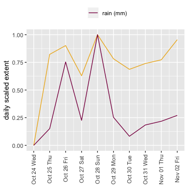
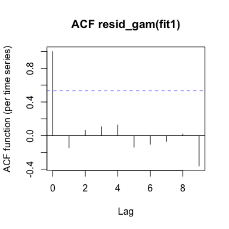

Publicly available databases and social media provide us unique insights on how human behaviour reflects the environment. These insights, however, are not given to us. We have to find them.

Open source software environments, like `R`, allow us to harvest public data easily, visualise it, and find interesting and relevant connections. This is a simple example. The actual connection is probably informative to nobody at all, but getting to it is fun.

### Rain in Seattle

What was the weather like in Seattle last week?

The [National Oceanic and Atmospheric Administration (NOAA)](https://www.noaa.gov/) collect a vast amount of climate information tracing back many years. They offer an [API](https://www.ncdc.noaa.gov/cdo-web/webservices/v2) to access their climate data, down to individual stations and measurements. The [R Open Science Project](https://ropensci.org/) offer an [R interface](https://github.com/ropensci/rnoaa) to many NOAA data sources. The [`countyweather`](https://cran.r-project.org/web/packages/countyweather/vignettes/countyweather.html) package is a helpful set of wrappers, available on the [Comprehensive R Archive Network (CRAN)](https://cran.r-project.org/), allowing us to collect daily and hourly climate data aggregated across US counties. Before you use it, you need to request a [token](https://www.ncdc.noaa.gov/cdo-web/token) from NOAA. They are pretty chill about it -- they will just email you one right away.

Seattle is in King County, WA. We can grab daily weather averages for the county using `countyweather`. We need to know the Federal Information Processing Standard Publication (FIPS) code for the county, which is 53033. Here, we look at the daily average precipitation (`prcp`) for this week (or a week a long time ago, depending on when you're reading this).

To do this, you need to authorise access to the NOAA data using a web services token, the one you got per email. Check the package [*readme*](https://cran.r-project.org/web/packages/countyweather/README.html) for details.

``` r
seattle_rain = daily_fips(fips = "53033", date_min = "2018-10-23", date_max = "2018-11-02", 
    var = "prcp")
seattle_rain = seattle_rain$daily_data  # we want the data themselves
```

Note that most weather stations are not *in* Seattle. But it's close enough.

We can plot the day-to-day average using `ggplot`.

``` r
rain_daily = seattle_rain %>%
  mutate(day = date %>% as.Date) %>% # make a new column called "day" which is a date, not a factor
  select(prcp,day) # keep this and the amount of precipitation 

ggplotTime = function(df, yval, colour, ylab, title){
ggplot(df, aes(x = day, y = yval)) + # plot the df, logged n n.tweets across day
  geom_line(colour = colour) + # draw a line
  scale_x_date(date_breaks = '1 day', date_labels = '%b %d %a') + #have an x axis tick per day, in a month-day format
  theme(axis.text.x = element_text(angle = 90, vjust = 0.5),
    axis.title.x=element_blank()) + # people can figure out what "OCT 31" is 
  ylab(ylab) + # nice ylab 
  ggtitle(title)  
}

ggplotTime(df = rain_daily,
yval = rain_daily$prcp,
colour = 'deeppink4',
ylab = 'daily precipitation, mm',
title = 'average rain in Seattle (King County)'
)
```


Brill. It rained heaps on Friday and Sunday.

### Twitter in Seattle

Did people talk about it?

We can't listen in on them, but we can read their tweets.

Twitter offers a developer platform. If you want to use the [API](https://developer.twitter.com/en/docs/basics/getting-started), you need to register an app and then authorise access. There are a number of R clients, we will use **rtweet**. The [*readme*](https://rtweet.info/) provides step-by-step instructions.

Twitter is like a firehose, and the API typically only allows you access to the last 6 or 7 days. We want to narrow down the query by looking for useful keywords, such as **weather** or **rain**.

``` r
tweets = search_tweets2(c("weather", "rain"), geocode = "47.605482,-122.326892,50mi", 
    include_rts = F, n = 10000)  # the geocode tells the function to look for tweets within a 50 mile radius of downtown Seattle, we exclude retweets, and put a maximum cap on the query.

tweets = tweets %>% select(user_id, status_id, created_at, text)  # the function returns a range of details. we only care about the user and status id, the date when the tweet was twot, and the text.
```

We want daily counts of tweets of **weather** or **rain** for this one-week period.

``` r
tweets_daily = tweets %>% 
  mutate(date = ymd_hms(created_at)) %>% # turn date into a nice format
  arrange(date) %>%  # arrange by it
  group_by(day = floor_date(date, 'day') %>% as.Date) %>%  # strip h-m-s and group by days
  summarise(n.tweets = n()) %>% 
  mutate(log.tweets = log(n.tweets)) # count how many tweets fall to one day
```

People in Seattle, much like elsewhere, talk quite a lot about the weather. I logged the number of tweets per day, because that makes spikes easier to perceive.

``` r
ggplotTime(df = tweets_daily, yval = tweets_daily$log.tweets, colour = "goldenrod2", 
    ylab = "daily weather tweet count (logged)", title = "tweets on weather round Seattle")
```


### Talking about the weather

It comes as no great surprise that, when it rains round Seattle, people there *tweet about it*. Note that these are unique tweets, not people retweeting the same AccuWeather post or something like that. Some users are repeated in the sample, but this has very little effect on data distribution.

``` r
s_daily = tweets_daily %>% # take daily tweets
  merge(rain_daily) %>%  # merge with daily precipitation
  select(-n.tweets) %>% # we don't need this
  mutate(log.tweets = scales::rescale(log.tweets), # rescale variables so we can compare them
          prcp = scales::rescale(prcp)) %>% 
  gather(variable, value, -day)

ggplot(s_daily, aes(x = day, y = value, colour = variable)) + # plot the new df, logged n n.tweets across day
  geom_line() + # draw a line
  scale_x_date(date_breaks = '1 day', date_labels = '%b %d %a') + #have an x axis tick per day, in a month-day format
  theme(axis.text.x = element_text(angle = 90, vjust = 0.5),
    axis.title.x=element_blank(), # people can figure out what "OCT 31" is 
    legend.position="top") + # put legend on too
  ylab('daily scaled extent') + # nice ylab
  scale_colour_manual(name = '', breaks = c('n.tweets', 'prcp'), labels = c('tweets (log(n))', 'rain (mm)'), values = c('goldenrod2','deeppink4')) # legend! no name, custom break labels, match colours with previous plots
```



Daily scaled extent? **What?** We are comparing numbers of tweets with milimetres of rain. I rescaled the two variables so we see their relative shifts, not their absolute values. There is *more rain and more tweets* on Oct 26 than on Oct 24, etc.

Those who still don't quite believe that this is happening can fit a simple GLM to predict the relationship between the daily tweet counts and the amount of rain.

``` r
s_daily_w = tweets_daily %>% # we need a wide dataset to do this. grab firt one
  merge(rain_daily) %>% # add second one
  mutate(n.tweets = n.tweets, # we keep counts for the counts model
    s.prcp = scale(prcp)) # but scale prcp (amount of rain)

ggplot(s_daily_w, aes(x = s.prcp, y = n.tweets)) + # show relationship
  geom_point() +
  geom_smooth(method = 'glm', method.args = list(family = 'poisson')) + # fit a Poisson model (for count data)
  ylab('daily weather tweet count (logged)') +
  xlab('daily precipitation, mm')
```


This is all rather vacuous with so few data points, but it is worth noting that temporal autocorrelation doesn't seem terrible -- it's not the case that once people start tweeting about rain, they keep tweeting.

``` r
fit1 = glm(n.tweets ~ s.prcp, data = s_daily_w, family = "poisson")
itsadug::acf_resid(fit1)  # build ACF plot for the LM
```



You know, maybe not this analysis, but a similar analysis has many uses:

-   Test the magnitude of social reaction to a specific natural / social event,
-   test the duration of social reaction to such an event,
-   predict undetected natural / social events based on social reaction.

A quick example:

``` r
nzhits = search_tweets("earthquake", n = 10000, include_rts = F, geocode = "-41.886256,173.236146,1000mi") # tweets on earthquakes in New Zealand

nzhits.s = nzhits %>% 
  select(user_id,status_id,created_at) %>% 
  mutate(day = created_at %>% as.Date) %>% # turn date into a nice format
  group_by(day) %>%  # strip h-m-s and group by days
  summarise(n.tweets = n())
```

Can you look at this figure...

``` r
ggplotTime(df = nzhits.s, yval = nzhits.s$log.tweets, colour = "orchid4", ylab = "daily tweet count (logged)", 
    title = "tweets on \"earthquake\" in New Zealand")
```


...and guess what happened on [Oct 30](https://www.geonet.org.nz/earthquake/2018p816466)?
